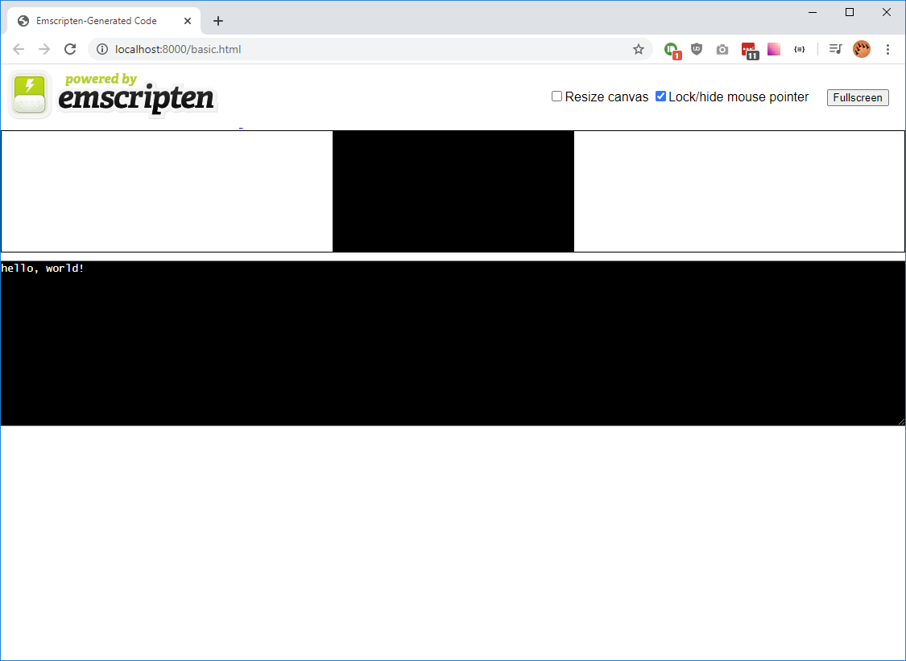
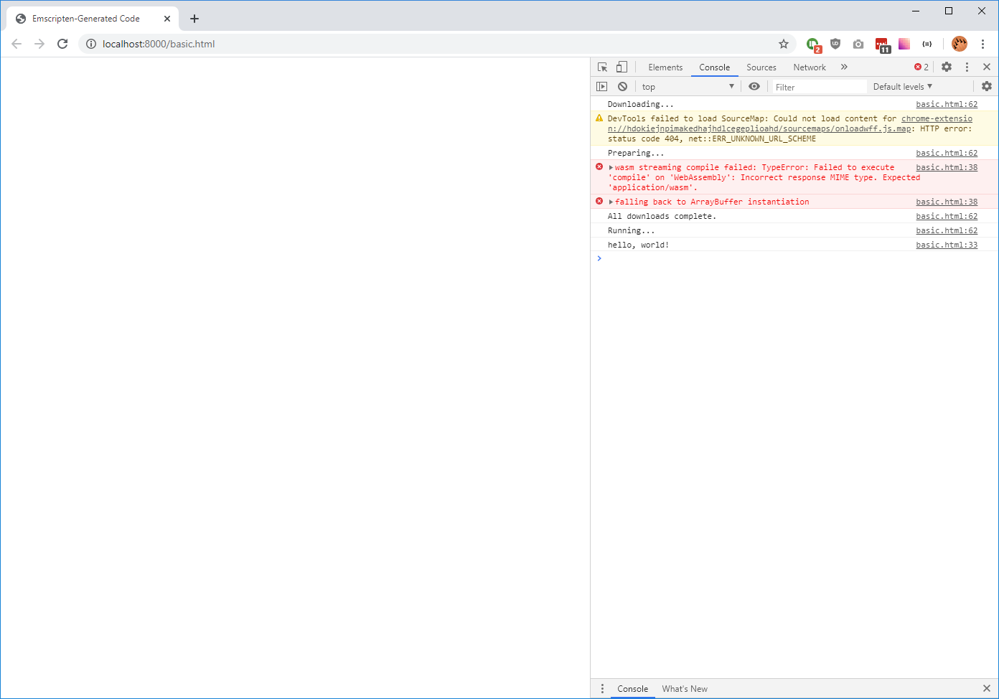
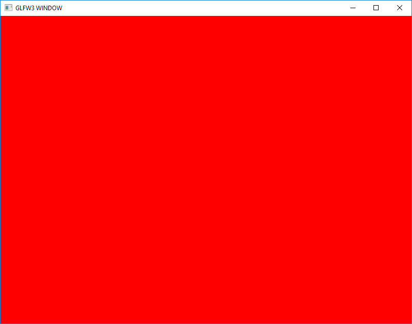
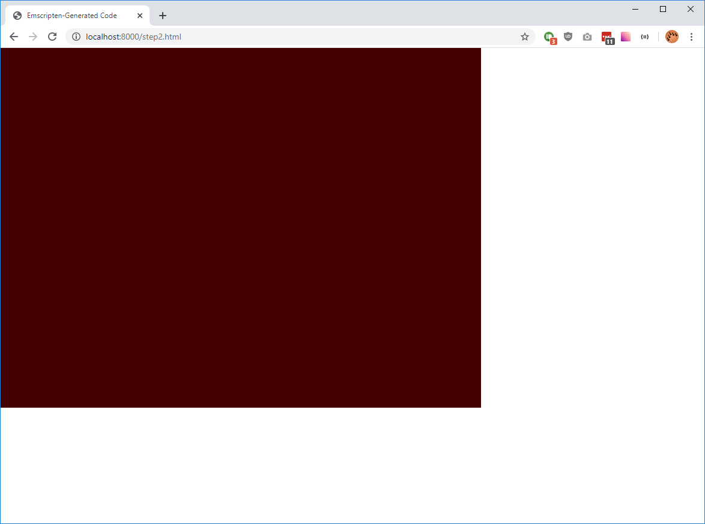
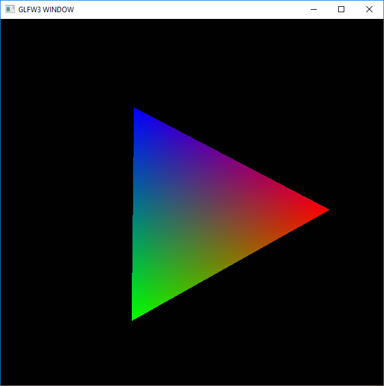

## Nim Emscripten Tutorial for Windows.

### Step 0: Making sure Emscripten can compile C:

Assumes Windows 10 64bit.

First, install Python if it is not already installed.

If you do not have Python installed, [get it here.](https://www.python.org/downloads/).

Note: ensure you check the box to add Python to your PATH.

After installing Python, [disable Windows 10's alias for Python](https://stackoverflow.com/questions/58754860/cmd-opens-window-store-when-i-type-python).

```sh
python --version
```

Should print this (or a newer version):

```
Python 3.8.3
```

Next, clone the `emsdk` - This is kind of like `choosenim` which will install the actual `emcc` compiler.

```sh
git clone https://github.com/emscripten-core/emsdk.git
cd emsdk
```

Lets install `emcc` - the actual compiler we will be using.

```sh
./emsdk install latest
./emsdk activate latest
./emsdk_env.bat
cd ..
```

After these commands run successfully (you should see some logs after each command), change directories into a clone of this repo and install the dependencies:

```sh
git clone https://github.com/treeform/nim_emscripten_tutorial
cd nim_emscripten_tutorial
nimble install
```

Now inside of the tutorial folder, lets compile a basic C program to make sure it works:

```sh
emcc step0.c -o step0.html
```

To view the files we need to run a webserver. The easiest one to run is the `nimhttpd`:

To install:
```sh
nimble install nimhttpd
```

To serve files, open a new shell window, move to the nim_emscripten_tutorial and run the webserver:
```sh
nimhttpd -p:8000
```

Next, open a browser to the step0 page:

```sh
start http://localhost:8000/step0.html
```

You should see the Emscripten default chrome:



Make sure you got the `Hello, world!` in the console.

To remove the ugly Emscripten default chrome, you need to use your own minimal html. I provided one in this repo, just call:

```sh
emcc step0.c -o step0.html --shell-file shell_minimal.html
```



Now the `Hello, world!` in the JS console.

### Step 1: Using Nim with Emscripten.

Next lets try Nim, look at the very simple [step1.nim](step1.nim):
```nim
echo "Hello World, from Nim."
```

Most of the work will be done but the [step1.nims](step1.nims) file:
```nim
if defined(emscripten):
  # This path will only run if -d:emscripten is passed to nim.

  --nimcache:tmp # Store intermediate files close by in the ./tmp dir.

  --os:linux # Emscripten pretends to be linux.
  --cpu:i386 # Emscripten is 32bits.
  --cc:clang # Emscripten is very close to clang, so we will replace it.
  --clang.exe:emcc.bat  # Replace C
  --clang.linkerexe:emcc.bat # Replace C linker
  --clang.cpp.exe:emcc.bat # Replace C++
  --clang.cpp.linkerexe:emcc.bat # Replace C++ linker.
  --listCmd # List what commands we are running so that we can debug them.

  --gc:arc # GC:arc is friendlier with crazy platforms.
  --exceptions:goto # Goto exceptions are friendlier with crazy platforms.

  # Pass this to Emscripten linker to generate html file scaffold for us.
  switch("passL", "-o basic.html --shell-file shell_minimal.html")
```

Lets compile it!

```sh
nim c -d:emscripten .\step1.nim
```

Lets go to step1.html, this is how it should look:

```sh
start http://localhost:8000/step1.html
```


Take note of the console output with `Hello World, from Nim.`.

### Nim with OpenGL.

We can do a ton of stuff with just "console" programs, but what Emscripten is all about is doing graphics. We can use normal OpenGL, and Emscripten will convert it to WebGL. We can also use normal SDL or GLFW windowing and input library and Emscripten will convert it to HTML events for us. Emscripten also gives us a "fake" file system to load files from. Many things that would be missing from just having WASM running in the browser we get from free with Emscripten.

I will be using GLFW for my examples. I will be using https://github.com/treeform/staticglfw because it has been made to work with Emscripten.

See: [step2.nim](step2.nim)

First lets make sure it runs in normal native mode:

```sh
nim c -r step2.nim
```



You should just see a window with changing background color.

Now lets try it with `-d:emscripten`:

```sh
nim c -d:emscripten step2.nim
```

Again a ton of work is happening in the settings file [step2.nims](step2.nims).

Lets go take a look at step2.html

```sh
start http://localhost:8000/step2.html
```




Again you should see red window with pulsating color.

### Step3: Nim with OpenGL Triangle.

The [step3.nim](step3.nim) is more complex as it requires loading shaders and setting up a triangle to draw. It also in includes a directory in a virtual files system:
`--preload-file data` which generates a file called `step3.data` which is loaded right before a module is run. It also handles resizing of window as well.

Again see it run natively:
```sh
nim c -r step3.nim
```



Then compile it for the browser:
```sh
nim c -d:emscripten step3.nim
```

And see it run:


